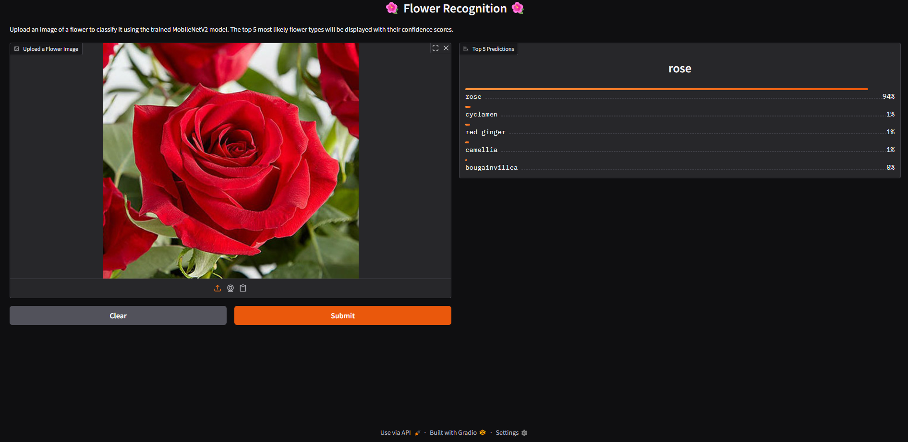

# 🌸🌼🌺 🌟 𝐅𝐋𝐎𝗪𝐄𝐑 𝐑𝐄𝐂𝐎𝐆𝐍𝐈𝐓𝐈𝐎𝐍 𝐒𝐘𝐒𝐓𝐄𝐌 🌟 🌺🌼🌸

A visually intelligent machine learning model that classifies and recognizes various flower species from images using deep learning.  
This system enhances automation in botanical classification by leveraging convolutional neural networks for precise flower identification.

---

## 🌟 Features

- 🌷 **Multi-Class Flower Detection**: Accurately classifies a variety of flower species with high precision.  
- 🌻 **User-Friendly Image Input**: Accepts standard image files for easy testing and evaluation.  
- 🌹 **CNN-Based Architecture**: Uses convolutional neural networks for advanced pattern and color recognition.  
- 🌼 **Efficient Training Pipeline**: Optimized for performance with clear training and validation workflows.  
- 🌺 **Scalable Model Design**: Can be extended to more categories or real-time camera input in future versions.

---

## 🌿 How to Use the Flower Recognition System

1. 📁 **Upload an Image**: Provide a clear image of a flower you want to identify.  
2. 🤖 **Run the Model**: The system processes the image using a trained ML model.  
3. 🏷️ **View Results**: The predicted flower name will be displayed with high accuracy.  

> 💡 *Ensure the image is well-lit and focused for best results.*

---

## 🧪 Tech Stack

- 🐍 **Python** – Core programming language for development and scripting.  
- 🧠 **TensorFlow / Keras** – For building and training the Convolutional Neural Network (CNN) model.  
- 📦 **NumPy & Pandas** – For data manipulation and preprocessing.  
- 🖼️ **Matplotlib & Seaborn** – To visualize training accuracy, loss, and sample predictions.    
- 💻 **Google Colab / Jupyter Notebook** – Development and testing environment.

---

## 🧠 Core AI Model: Convolutional Neural Network (CNN)

The heart of the Flower Recognition System is a **Convolutional Neural Network (CNN)**, a deep learning model ideal for image classification tasks.

### 🔍 Model Architecture Highlights:

- **Input Layer**: Accepts flower images resized to a fixed dimension (e.g., 180×180 pixels).  
- **Convolutional Layers**: Extract spatial features like petal shapes, colors, and textures.  
- **Pooling Layers**: Reduce dimensionality while preserving key features.  
- **Dense Layers**: Interpret extracted features and perform classification.  
- **Output Layer**: Uses `softmax` activation to predict the probability of each flower class.

> Trained on a labeled dataset of flower images with optimization using **Adam** optimizer and **categorical crossentropy** loss.

---

## 🖼️ Screenshot

Below is a sample test image used in the system:

